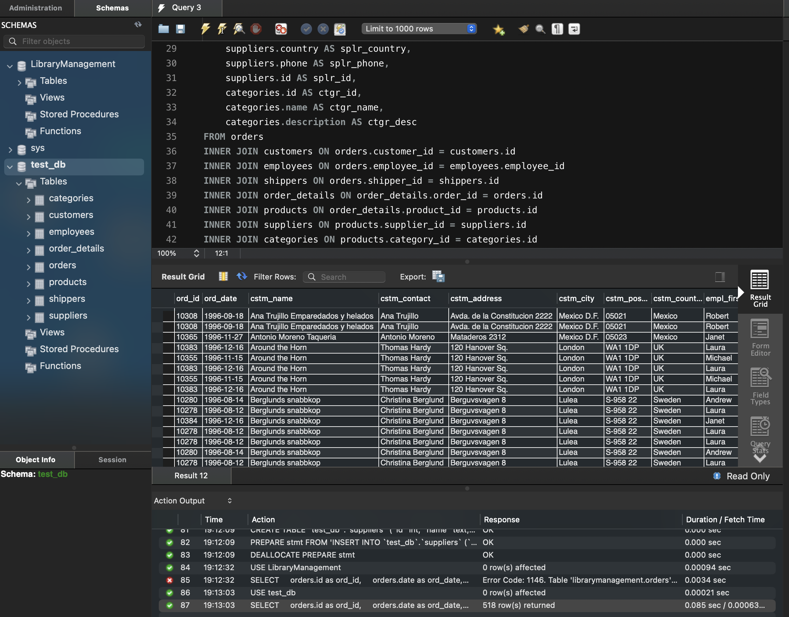

### task3
  Перейдіть до бази даних, з якою працювали у темі 3. Напишіть запит за
  допомогою операторів FROM та INNER JOIN, що об’єднує всі таблиці даних, які ми
  завантажили з файлів: order_details, orders, custom

```sql
USE LibraryManagement;

SELECT
    orders.id as ord_id,
    orders.date as ord_date,
    customers.name AS cstm_name,
    customers.contact AS cstm_contact,
    customers.address AS cstm_address,
    customers.city AS cstm_city,
    customers.postal_code AS cstm_postal,
    customers.country AS cstm_country,
    employees.first_name AS empl_first_name,
    employees.last_name AS empl_last_name,
    shippers.name AS shippers_name,
    shippers.phone AS shippers_phone,
    order_details.id as ord_details_id,
    order_details.quantity as ord_details_quantity,
    products.id as prod_id,
    products.unit as prod_unit,
    products.price as prod_price,
    products.id as prod_id,
    suppliers.id AS splr_id,
    suppliers.name AS splr_name,
    suppliers.contact AS splr_contact,
    suppliers.address AS splr_address,
    suppliers.id AS splr_id,
    suppliers.city AS splr_city,
    suppliers.postal_code AS splr_postal_code,
    suppliers.country AS splr_country,
    suppliers.phone AS splr_phone,
    suppliers.id AS splr_id,
    categories.id AS ctgr_id,
    categories.name AS ctgr_name,
    categories.description AS ctgr_desc
FROM orders
INNER JOIN customers ON orders.customer_id = customers.id
INNER JOIN employees ON orders.employee_id = employees.employee_id
INNER JOIN shippers ON orders.shipper_id = shippers.id
INNER JOIN order_details ON order_details.order_id = orders.id
INNER JOIN products ON order_details.product_id = products.id
INNER JOIN suppliers ON products.supplier_id = suppliers.id
INNER JOIN categories ON products.category_id = categories.id
```

#### Результат

