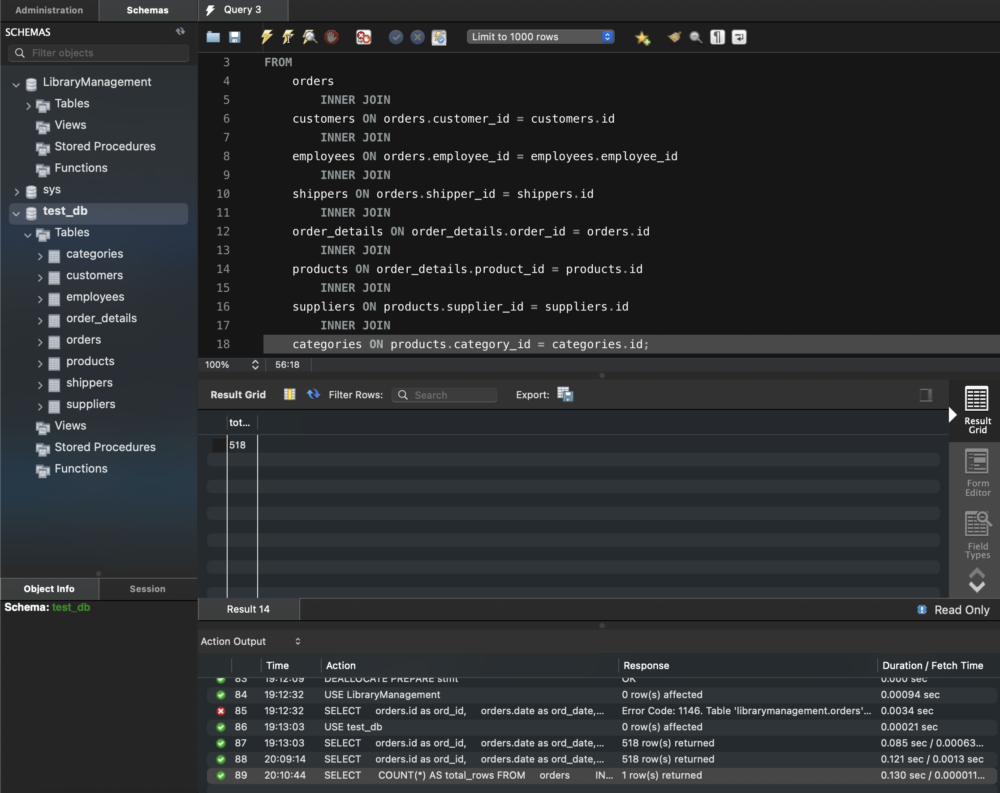

### task 4_1: 
Визначте, скільки рядків ви отримали (за допомогою оператора COUNT)

```sql
SELECT 
    COUNT(*) AS total_rows
FROM
    orders
        INNER JOIN
    customers ON orders.customer_id = customers.id
        INNER JOIN
    employees ON orders.employee_id = employees.employee_id
        INNER JOIN
    shippers ON orders.shipper_id = shippers.id
        INNER JOIN
    order_details ON order_details.order_id = orders.id
        INNER JOIN
    products ON order_details.product_id = products.id
        INNER JOIN
    suppliers ON products.supplier_id = suppliers.id
        INNER JOIN
    categories ON products.category_id = categories.id;
```

#### ResultSet


