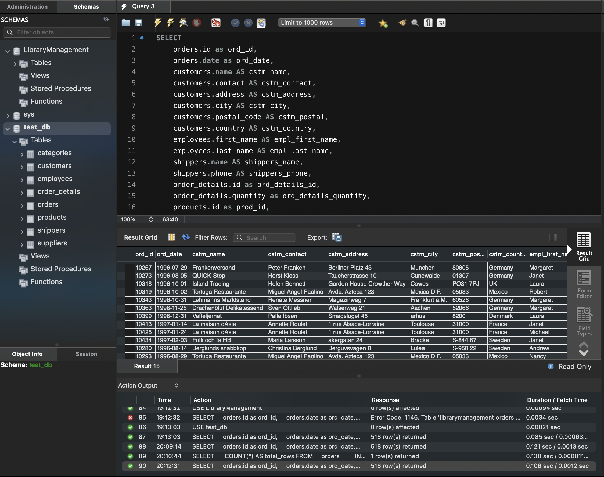

### task 4_2:
  Змініть декілька операторів INNER на LEFT чи RIGHT. Визначте, що відбувається
  з кількістю рядків. Чому? Напишіть відповідь у текстовому файлі.

```sql
SELECT
    orders.id as ord_id,
    orders.date as ord_date,
    customers.name AS cstm_name,
    customers.contact AS cstm_contact,
    customers.address AS cstm_address,
    customers.city AS cstm_city,
    customers.postal_code AS cstm_postal,
    customers.country AS cstm_country,
    employees.first_name AS empl_first_name,
    employees.last_name AS empl_last_name,
    shippers.name AS shippers_name,
    shippers.phone AS shippers_phone,
    order_details.id as ord_details_id,
    order_details.quantity as ord_details_quantity,
    products.id as prod_id,
    products.unit as prod_unit,
    products.price as prod_price,
    products.id as prod_id,
    suppliers.id AS splr_id,
    suppliers.name AS splr_name,
    suppliers.contact AS splr_contact,
    suppliers.address AS splr_address,
    suppliers.id AS splr_id,
    suppliers.city AS splr_city,
    suppliers.postal_code AS splr_postal_code,
    suppliers.country AS splr_country,
    suppliers.phone AS splr_phone,
    suppliers.id AS splr_id,
    categories.id AS ctgr_id,
    categories.name AS ctgr_name,
    categories.description AS ctgr_desc
FROM orders
LEFT JOIN customers ON orders.customer_id = customers.id
LEFT JOIN employees ON orders.employee_id = employees.employee_id
LEFT JOIN shippers ON orders.shipper_id = shippers.id
LEFT JOIN order_details ON order_details.order_id = orders.id
RIGHT JOIN products ON order_details.product_id = products.id
RIGHT JOIN suppliers ON products.supplier_id = suppliers.id
RIGHT JOIN categories ON products.category_id = categories.id;
```

#### ResultSet


