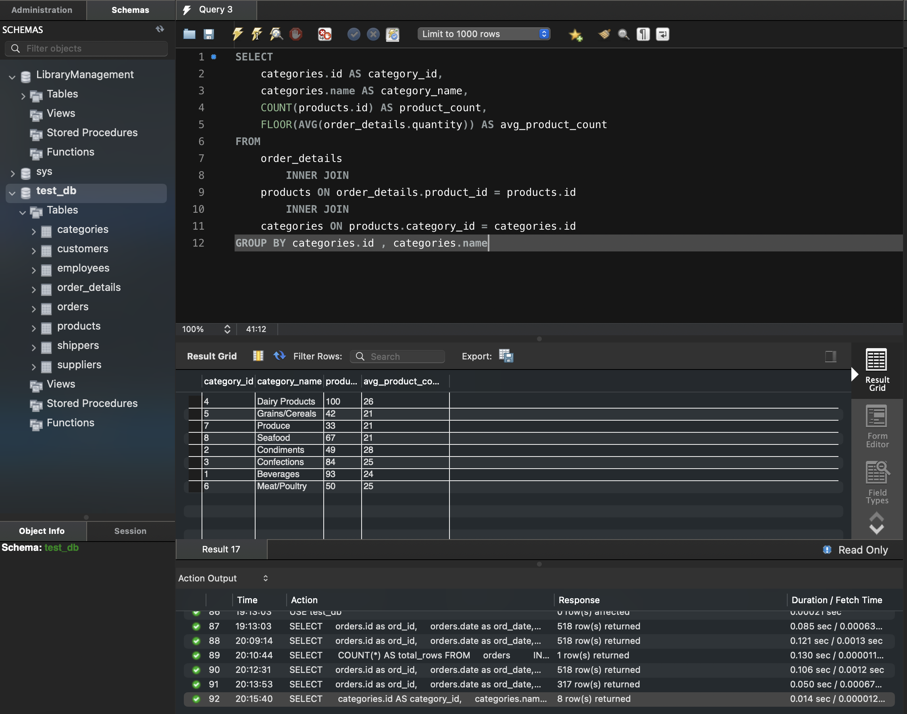

### task 4_4:
  Згрупуйте за іменем категорії, порахуйте кількість рядків у групі, середню
  кількість товару (кількість товару знаходиться в order_details.quantity)

```sql
SELECT 
    categories.id AS category_id,
    categories.name AS category_name,
    COUNT(products.id) AS product_count,
    FLOOR(AVG(order_details.quantity)) AS avg_product_count
FROM
    order_details
        INNER JOIN
    products ON order_details.product_id = products.id
        INNER JOIN
    categories ON products.category_id = categories.id
GROUP BY categories.id , categories.name
```

#### ResultSet
